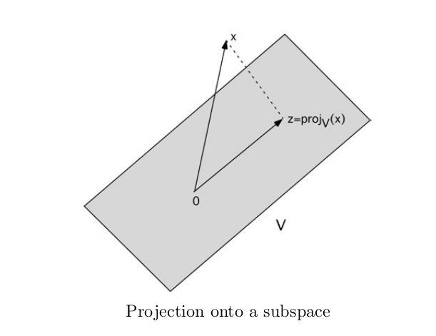

# Equações de Kolmogorov

## Independência de Eventos

Uma das vantagens que a Teoria de Probabilidade nos fornece, é a possibilidade de atribuir uma medida de probabilidade à um evento baseado na composição de eventos mais elementares. De um ponto de vista matemático:

Se 

$$ A = B \cup C $$

então:

$$ P(A) = P(B) + P(C) - P(B \cap C) $$

Se B e C são eventos independentes , então;

$$ P(A) = P(B) + P(C) $$

Ainda mais, se particionarmos um evento A num conjunto de eventos $A_j$ mutuamente independentes, teremos que

$$ P(A) = \sum_{j}^{J} P(A|A_j)P(A_j) $$

, os quais os eventos $A_j$ formam uma espécie de base com projeção $P(A|A_j)$ no 'vetor' A. Tal raciocínio pode ser usado para dedução de propriedades de processos Markovianos.

## Equação BKE (Bakward Kolmogorov Equation)

Um evento $A = (n(t) = n | n(0) = 1)$ pode ser visto como a combinação de dois eventos exclusivos

* $A_1$ = 'A única partícula no meio no instante $t_0 = 0$ não reage com nenhum núcelo até o tempo t e assim , o número de partúclas será 1 no tempo t'

* $A_2$ = 'A única partícula no meio no instante $t_0 = 0$ reage com um núcleo no tempo t em algum subintervalo (t' , t' + dt'] do intervalo (0,t]. '

* $A_3$ = 'Dado que o nêutron reagiu e gerou k nêutrons , os k nêutrons reagem de tal forma que produza n neutrons-filhos'

Desta forma, o evento A pode ser visto como:

$$ P(A) = P(A_1) + \int_0^{t} P(A_2)P(A_3) dt' $$

Matematicamente:

$$ p_n(t) = exp(-Qt)\delta_{n1} + Q\int_{0}^{t} exp(-Qt')[\sum_{k = 0}^{\infty}f_k \sum_{n_1 + n_2 + ... + n_k} \prod_{j}^{k}p_{n_{j}}(t-t')]dt' $$

Aplicando uma transformação de variáveis, multiplicando por z e somando, encontramos a equação:

$$ g(z,t) = exp(-Qt)z + Q\int_{0}^{t} exp(-Q(t-t')) \sum_0^{\infty}f_k[g(z,t')]^k dt' = $$

$$ g(z,t) = exp(-Qt)z + Q\int_{0}^{t} q( g(z,t-u) ) exp(-Qu)  du $$

Derivando em relação a t, encontramos Bakward Kolmogorov Equation:

$$ \frac{\partial g(z,t)}{\partial t} = -Qg(z,t) + Qq[g(z,t)] $$

Com condição inicial:

$$ g(z,0) = z $$

## Equação FKE (Foward Kolmogorov Equation)

Sendo o processo de Poisson, podemos considerar que $nQ\Delta t + o(\Delta t)$ é a probabilidade de que uma reação ocorra no intevalo $\Delta t$ em um meio com n nêutrons. Assim, o evento $A = (n(t+\Delta t) = n | n(0) = 1)$ é a composição de:

* $A_1$ = 'O sistema já possui n nêutrons no instante t e nenhuma reação ocorre no intervalo $\Delta t$'

* $A_2$ = 'O sistema possui n-k+1 nêutrons no instante t e no intervalo \Delta t ocorre a ramificação de k nêutrons'

Matematicamente:

$$ p_n(t + \Delta t) = p_n(t)(1 - nQ\Delta t) + Q\Delta t \sum_{k = 0}^{n}f_k(n-k+1)p_{n-k+1}(t) $$

Rearranjando a equação e aplicando o limite $\Delta t \to 0$ , chegamos na Foward Kolmogorov Equation:

$$ \frac{\partial g(z,t)}{\partial t} = Q(q(z) - z) \frac{\partial g(z,t)}{\partial z} $$

com condição inicial $ g(z,0) = z $

