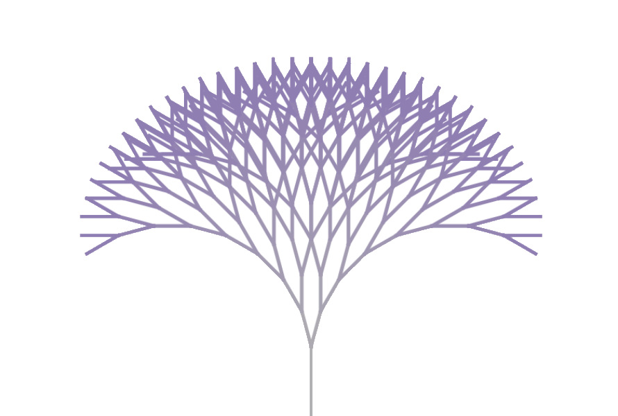

# Introdução

# Modelagem probabilística do processo de ramificação de nêutrons em um meio infinito

Um processo ramificativo é um processo estocástico cujas variáveis randômicas são indexadas pelos números naturais. Neste processo, cada indivíduo da geração n produz um número aleatório de outros indivíduos que irão compor a geração n+1

O meio no qual tais variáveis se multiplicam é chamado meio multiplicativo. 

No presente trabalho, os objetos analisados são nêutrons que se multiplicam em um reator pontual. O intervalo de tempo de vida do nêutron , ou seja, o tempo de primeira interação, obedecerá uma distribuição de Poisson que para fins de simulação , será dado por um número randômico.

$$ \delta t_i = \frac{- log(\xi)}{\Sigma}  $$

O evento de interação entre os nêutrons e os núcleos será chamada reação que resultará sempre na absorção do nêutron pai e na criação instantânea de um número randômico de nêutrons.

$$ \nu = 0 , 1 , 2 , ... $$

Será assumido que os nêutrons são mono-energéticos, ou seja, apenas uma velocidade é permitida

