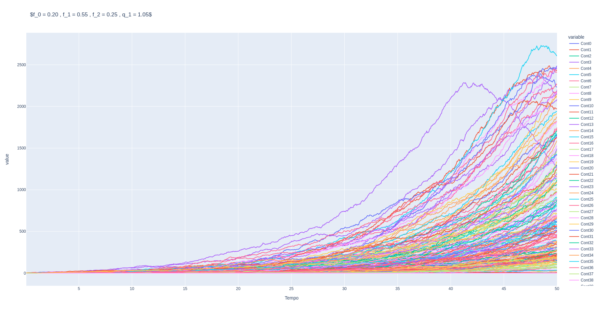

# Modelagem probabilística do processo de ramificação de nêutrons em um meio infinito

## Descrição:

 Uma descrição quantitativa da população neutrônica em um reator nuclear pode ser formulada matematicamente de diversas formas. Uma das formas mais usuais é feita em termos do fluxo angular de nêutrons obtido pela solução da Equação de Boltzmann para nêutrons. A solução desta equação irá nos dar um valor esperado da densidade do fluxo angular de nêutrons. Uma outra abordagem baseada no processo de ramificação dos nêutrons em um meio multiplicativo se apresenta como alternativa à equação de Boltzman para nêutrons. 
 
 Este modelo é um modelo probabilístico que fornece resultados diferentes do modelo de Boltzmann , que é determinístico mas, devido à complexidade material e geométrico do reator, é de difícil solução.  O modelo estudado é um caso relativamente simples se comparado com qualquer processo de fissão realístico. Será assumido que que os nêutrons são monoenergéticos.  A colisão entre nêutrons e núcleos resulta ou em absorção ou na produção de um número randômico de nêutrons emitidos com distribuição isotrópica em um meio infinito. 
 
 É derivado no trabalho, as duas princiapis equações ( equações Foward e Backward de Kolmogorov ) que descrevem o processo. Ambas as equações serão resolvidas em termos da chamada Função Geradora, que por sua vez é dotada de uma série de propriedades que serão apresentadas, sendo a mais importante, a propriedade Markoviana da Função Geradora. Uma vez que o modelo é probabilístico, foi desenvolvido em C++ um código que seja capaz de criar cenários do processo, e assim, computar as probabilidades que irão compor o modelo. Será apresentado a convergência das soluções analíticas para a Função Geradora com a sua construção computacional.

## Description: 
A quantitative description of the neutron population in a nuclear reactor can be mathematically formulated in various ways. One of the most common forms is expressed in terms of the angular neutron flux obtained by solving the Boltzmann Equation for neutrons. The solution to this equation will provide an expected value for the angular neutron flux density. Another approach, based on the neutron branching process in a multiplicative medium, presents itself as an alternative to the Boltzmann equation for neutrons.

This model is a probabilistic model that yields different results from the deterministic Boltzmann model due to the material and geometric complexity of the reactor, making it challenging to solve. The studied model is a relatively simple case compared to any realistic fission process. It is assumed that neutrons are monoenergetic. The collision between neutrons and nuclei results in either absorption or the production of a randomly determined number of neutrons emitted with isotropic distribution in an infinite medium.

In the work, the two main equations (Forward and Backward Kolmogorov equations) describing the process are derived. Both equations will be solved in terms of the so-called Generating Function, which, in turn, possesses a series of properties that will be presented, with the most important being the Markovian property of the Generating Function.

Since the model is probabilistic, a C++ code has been developed to create scenarios of the process and compute the probabilities that constitute the model. The convergence of the analytical solutions to the Generating Function with its computational construction will be presented.

